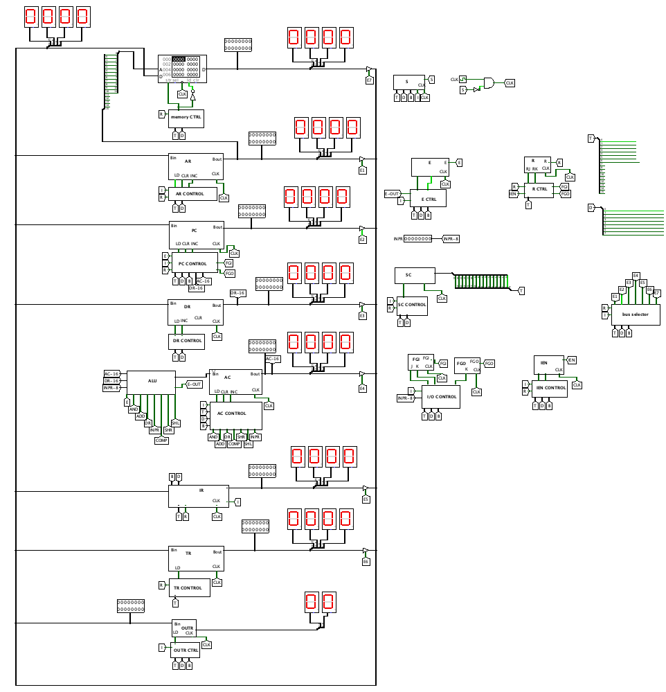

# CPU Project Readme

**Table of Contents**

- [Introduction](#introduction)
- [CPU Screenshot](#cpu-screenshot)
- [Technology Stack](#technology-stack)
- [Getting Started](#getting-started)
- [Requirements](#requirements)

---

## Introduction

This endeavor is the culmination of my efforts in a Computer Organization course.
My primary objective was to conceptualize and construct a fully operational CPU (Central Processing Unit) replete with an ALU (Arithmetic Logic Unit)
and other pivotal components.

## CPU Screenshot

### Hardware Components

My CPU architecture comprises a plethora of vital hardware components, including:

- **Memory Unit**: With a generous capacity of 4096 words, each consisting of 16 bits.
- **Registers**: A collection of nine registers: AR, PC, DR, AC, IR, TR, OUTR, INPR, and SC.
- **Flip-Flops**: A complement of seven flip-flops: I, S, E, R, lEN, FGI, and FGO.
- **Decoders**: Encompassing a 3 x 8 operation decoder and a 4 x 16 timing decoder.
- **Common Bus**: A robust 16-bit common data bus, facilitating seamless data transfer.
- **Control Logic Gates**: An intricate network of logic gates responsible for data flow and operations.
- **Adder and Logic Circuit**: Meticulously connected to the input of AC, these components facilitate arithmetic and logic operations.

---

## Technology Stack

My CPU project was brought to life with the aid of the following technologies:

- [Logisim](https://www.cburch.com/logisim/): A user-friendly digital logic simulator renowned for its versatility and power.

---

## Getting Started

To embark on your journey with our CPU project, follow these simple steps:

1. Clone the project repository to your local machine.

2. Launch Logisim and open our CPU project.

3. Delve into the intricacies of the CPU's functionality and feel free to experiment or expand upon its design according to your academic or personal needs.

---

## Requirements

Before you immerse yourself in this project, ensure that you have the following prerequisites in place:

- [Logisim](https://www.cburch.com/logisim/): Make sure you've installed Logisim on your computer to seamlessly work with the CPU design.

